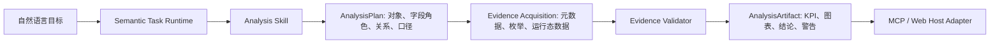

# 云枢分析 Skill 与结果体验架构

## Problem Statement

当前 MCP 的分析分支只读取单一实体的有限记录并返回总数和摘要卡片。它没有获取字段语义、业务状态枚举、关联对象或分析产物，因此宿主只能把“调用成功”转述为普通文本，不能可靠地呈现“在建项目分析”。

## User Intent

终端用户以自然语言提出分析目标，获得可核验的指标、图表、结论、数据范围与下一步追问；不需要提供模型编码、字段编码或反复要求工具探查 JSON。

## Success Criteria

- 分析任务返回结构化 `AnalysisArtifact`，包含 KPI、图表、发现、数据范围、置信度与警告。
- “在建”等业务条件必须由已同步字段元数据与枚举定义验证；无法验证时明确说明，不使用全量总数替代。
- 宿主不支持卡片时仍能直接呈现完整业务 Markdown，不再要求再次工具调用。
- Skill 不绑定具体业务对象或接口；模型只能选择受治理的执行路径。

## Constraints

- 云枢真实写入仍需要已验证契约和人工确认。
- MCP 临时账号密码不得持久化；结果、事件和审计不得暴露编码、凭据或原始推理。
- 外部宿主是否原生渲染卡片不可假设，必须同时提供可读降级结果。

## Options Explored

### Option A: 扩充 MCP 文本提示

最低成本，但没有字段/枚举验证、图表产物或跨宿主一致性；不能解决重复调用和全量误判。

### Option B: 为每个对象写报告模板

能快速改善项目展示，但把项目、商机、客户等业务对象写进代码，后续对象扩展和口径治理成本高。

### Selected: 通用分析 Skill + 证据与产物契约

将分析执行方式约束为可插拔 Skill：先形成经元数据验证的 `AnalysisPlan`，再生成带证据、图表和文字结论的 `AnalysisArtifact`。Skill 声明能力与完成条件，不声明具体项目字段或 API；实体、关系、状态和指标由计划在运行时决定。

## Architecture Sketch

## Key Decisions

- 分析 Skill 是必要的执行约束，但不是固定报告模板；它约束证据、计划、校验和输出品质。
- `InsightReportService` 的 KPI、图表、警告与报告 DTO 是复用基础；先将其数据读取抽象为请求级执行范围，避免 MCP 使用 CPClaw 本地凭据。
- `TaskExperienceEnvelope.output` 增加 `artifact`，并同时输出宿主可直呈的 Markdown 摘要和机器可消费的图表数据。
- 状态分析必须先读取字段元数据及选项；不能证明“在建”口径时，返回数据不足说明和可追问项，而非将总数标为在建。

## Open Questions

- 外部宿主对 `structuredContent`、Markdown 表格和图表的实际渲染能力需在目标终端验证。
- 云枢项目实体的真实业务阶段字段、枚举与关联对象需要通过元数据同步或契约探查确认。

## Next Steps

先形成产品与技术方案，再实现请求级读取范围、Analysis Skill、Artifact 协议和 MCP 适配；随后用真实项目数据验证范围、字段、图表、追问与降级体验。
